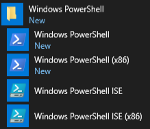
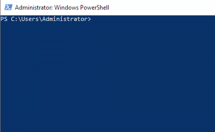
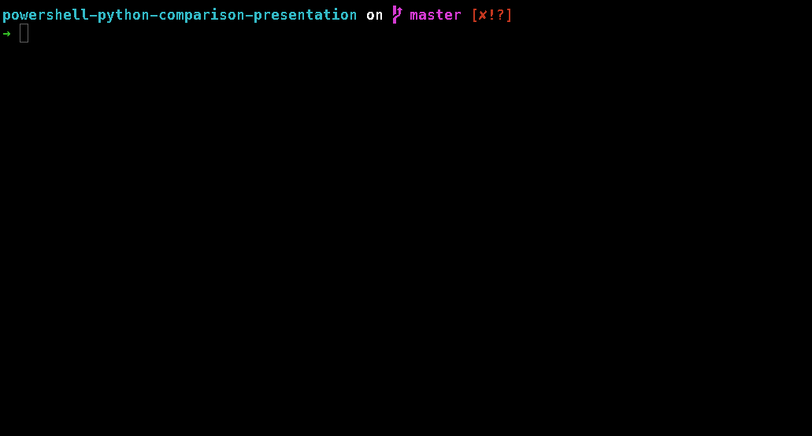
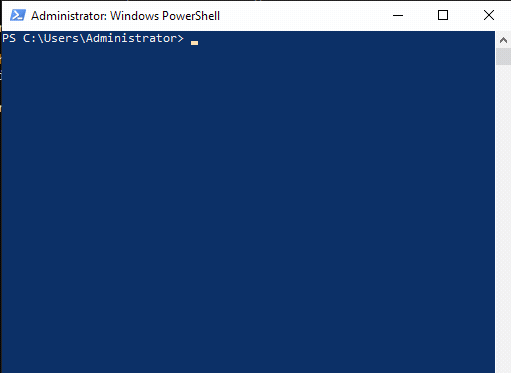

<br>
<br>
<br>
<br>
<br>
<br>
<br>
<br>
<br>
<br>
<br>
<br>
<br>
<br>
<br>
<br>
<br>
<br>

<center><h1>PowerShell</h1></center>

<center><h2>A side</h2></center>

<center><h2>compa</h2></center>
</center>

<br>
<br>
<br>
<br>
<br>
<br>
<br>
<br>
<br>
<br>
<br>
<br>
<br>
<br>
<br>
<br>
<br>
<br>

# PowerShell

* Used since 2014
  * Active Directory, Software Deployment, GPOs, etc.
* Created PPRT (PowerShell Phishing Response Toolkit)
* Created 10,000+ line GUI app for QualysGuard VM
* Continued with automating and releasing around 40+ Modules

## Highlights

* PSRegistry (WIN_API wrapper for accessing multiple HKCU hives)
* CreateProfile (WIN_API to create Windows profiles)
* PSQueue (Queue using PowerShell)
* CaptureIt (Generate GIFs using PowerShell)
* PSNetStat (Recreates netstat.exe using PowerShell)
* PSLogging (PS5 Class for Logging)
* UpgradePowerShell (A PS module to upgrade PS from 1 version to any other)
* Others include:
  * GetGithubRepository
  * PoshZD
  * PSDigitalOcean
  * WriteLogEntry
  * PSCVSS
  * etc.
<br>
<br>
<br>
<br>
<br>
<br>
<br>
<br>
<br>
<br>
<br>
<br>
<br>
<br>
<br>
# PowerShell History

> Powershell is a task automation and configuration management framework from Microsoft

* **Monad** - First shown publicly in 2003
* 1.0 - 2006 for Windows XP SP2, Server 2003 SP1, and Vista
* PowerShell **2.0** - Windows 7 & Server 2008 R2
  * Remoting, Background Jobs, Advanced Functions, Modules, Debugging, ISE, etc.
* PowerShell **3.0** - Windows 8 & Server 2012
  * Scheduled Jobs, Delegation Support, Updateable Help, and TONS of new Cmdlets
* PowerShell **4.0** - Windows 8.1 Server 2012 R2
  * Desired State Configuration, Ehanced Debugging, improvided filtering and interation over objects
* PowerShell **5.0** - 2016 - Windows 10
  * Package Management, Classes, Runspaces, DSC & Local Configuration Manager (LCM)
* PowerShell **5.1** - 2016 - Windows 10 Anniversary Update & Server 2016
  * **Desktop & Core** Versions
* PowerShell Core **6.0** - 2016
  * Microsoft open-sources PowerShell, Supports Windows, macOS, & Linux
* PowerShell Core **6.1** - Windows 10 & Server 2019
  * Compatibility with 1900+ existing Cmdlets in Windows 10 and Windows Server 2019
  * Supports latest version of Windows, macOS, and Linux
* PowerShell Core **6.2**
  * Performance improvements, bug fixes, and smaller changes
* PowerShell **7.0** - 2019 (TBD)
  * Combining both Windows PowerShell **5.1** & PowerShell Core **6.2** 
  * COMPLETE cross platform compatibility
<br>
<br>
<br>
<br>
<br>
<br>
<br>
<br>
<br>
<br>
<br>
<br>
<br>
<br>
<br>
# PowerShell (Windows Installation)

## Windows PowerShell (1 - 5.1)

    Windows 7 -> Windows PowerShell v2

    Windows 8 -> Windows PowerShell v3

    Windows 8.1 -> Windows PowerShell v4

    Windows 10 -> Windows PowerShell v5

> ### All versions are backwards compatible

### Windows Management Framework (WMF)

> ### To upgrade PowerShell versions you install a new WMF version

### Example

> Windows 7, by default, has Windows PowerShell v2 but you can install up to the latest version of both Windows PowerShell & PowerShell Core by installing a new WMF version

## PowerShell Core

> PowerShell Core is based on .NET Core

> You can download and install the latest binaries from the PowerShell GitHub repository

### Windows Installation Options

* GitHub Download
* Chocolatey (third-party package manager)

    ```powershell
    choco install powershell-core -y
    ```
<br>
<br>
<br>
<br>
<br>
<br>
<br>
<br>
<br>
<br>
<br>
<br>
<br>
<br>
<br>

# PowerShell (macOS & Linux Installation)

## PowerShell Core

> PowerShell Core is based on .NET Core

> You can download and install the latest binaries from the PowerShell GitHub repository

## Installation Options

### macOS

* GitHub Download
* Homebrew
  
    ```bash
    brew cask install powershell
    ```

### Ubuntu, Debian, CentOS, RedHat, Fedora

* GitHub Download
* Package Managers

|Distribution(s) |Stable Command                     |Preview Command                    |
|----------------|-----------------------------------|-----------------|
|Ubuntu, Debian  | sudo apt-get install -y powershell|sudo apt-get install -y powershell-preview|
|CentOS, RedHat| sudo yum install -y powershell | sudo yum install -y powershell-preview
|Fedora|sudo dnf install -y powershell|sudo dnf install -y powershell-preview|
<br>
<br>
<br>
<br>
<br>
<br>
<br>
<br>
<br>
<br>
<br>
<br>
<br>
<br>
<br>

# Windows PowerShell

> Windows PowerShell can be accessed via the `PowerShell` console's



    You can also access Windows PowerShell via cmd.exe 


<br>
<br>
<br>
<br>
<br>
<br>
<br>
<br>
<br>
<br>
<br>
<br>
<br>
<br>
<br>

# PowerShell Core (macOS)

> PowerShell Core can be accessed by using it's own console as well, but you may notice that it is the traditional black cmd type console

## pwsh.exe

### When PowerShell Core was released, they also changed the name of the executable to `pwsh.exe`


<br>
<br>
<br>
<br>
<br>
<br>
<br>
<br>
<br>
<br>
<br>
<br>
<br>
<br>
<br>

# PowerShell Terms

## Cmdlet (Command-Let)
    Binary based Cmdlet's

## Modules
    Script based Cmdlet's
    Binary based Cmdlet's

## Classes
    PowerShell v5+ implemented Classes

## Advanced Functions
    Script based Cmdlet's

- Static Parameters
- Dynamic Parameters

## Functions & Scripts
    Are basic functions or logic in a single file
<br>
<br>
<br>
<br>
<br>
<br>
<br>
<br>
<br>
<br>
<br>
<br>
<br>
<br>
<br>

# PowerShell Syntax

## **Everything** is an object (even text)!
- Objects (for simplicity) have both properties and methods

## Built-In Cmdlet's and adv. functions should follow the {Verb}-{Noun} syntax but it is not required

    # PowerShell has an approved verb list
    Get-Verb

> ### Example
    Invoke-MyAwesomePowerShellFunction.ps1

## Each Function has their own set of parameters

## Example

    {Verb}-{Nount} -{parameter} {value}
    Get-Process -Name dns
<br>
<br>
<br>
<br>
<br>
<br>
<br>
<br>
<br>
<br>
<br>
<br>
<br>
<br>
<br>

# PowerShell Help

    Lots of documentation from Microsoft
    Built-In Help system (plus updateable)

## help & Get-Help
    help -Name Get-Help




## Searching

Adding `powershell` or `Cmdlet` to any google search will result in better results
> Microsoft actually went with Cmdlet because it was unique and could be searched easily

## Resources I use

+ ### Google
+ ### Microsoft's Documentation (seriously!) 
+ ### Stackoverflow
+ ### powershell.org
+ ### reddit.com/r/powershell
+ ### Blogs
<br>
<br>
<br>
<br>
<br>
<br>
<br>
<br>
<br>
<br>
<br>
<br>
<br>
<br>
<br>

# Running Scripts

## Get-MyIp.ps1

    $response = Invoke-RestMethod -Uri 'https://api.myip.com'

    Write-Host $response

## Running Get-MyIp.ps1

    pwsh ./Get-MyIp.ps1

## Returns

    @{ip=173.26.223.222; country=United States; cc=US}

<br>
<br>
<br>
<br>
<br>
<br>
<br>
<br>
<br>
<br>
<br>
<br>
<br>
<br>
<br>

# Alternate Ways of Running PowerShell

## Running Scripts with Arguments

    > .\Invoke-SomeScript.ps1 $var1 $var2 $var 3
    > .\Invoke-SomeScript.ps1 -Param1 $var1 -Param2 $var2

    
## Running Commands Directly

    > powershell.exe -Command "(Get-Process).Name"

## Invoking PowerShell Directly

    > powershell.exe -File c:\some-script.ps1
<br>
<br>
<br>
<br>
<br>
<br>
<br>
<br>
<br>
<br>
<br>
<br>
<br>
<br>
<br>

# PowerShell Variables

> Variables are assigned to the left of an operator

    $exampleVar = 'My Example Value'

### Conventions

> _**NOTE**_: These styles are recommendations based on community best practices

## **PascalCase**
> Use PascalCase for all public facing code

 - Modules
 - Functions & Cmdlet's
 - Parameters
 - Global Variables
 - Constants

```
# Correct
Get-MyIp -Computer 'localhost'

# In-Correct
Get-MyIp -computer 'localhost'
```
## **camelCase**
> It's a preference, but using camelCase identifies a variable as a private/internal variable

- Variables that are internal to scripts/functions
<br>
<br>
<br>
<br>
<br>
<br>
<br>
<br>
<br>
<br>
<br>
<br>
<br>
<br>
<br>

# Using Variables in PowerShell

## Variables can dynamically change
    $stringVar = '1'  # actual string variable
    $stringVar =  1   # now an integer variable

## Variables are automatically created on first use
    $numVar = 1

## Variables can contain multi-line strings
    $blockVar = @"
    Here's some text

    And here is some text
    @"

## Casting Variables
    $numVar = '1'  # String variable
    [int]$numVar   # Integer variable
<br>
<br>
<br>
<br>
<br>
<br>
<br>
<br>
<br>
<br>
<br>
<br>
<br>
<br>
<br>

# PowerShell Strings, Quotes, & Encapsulation

## Single Quotes Usage

> Use single quotes when a string is literal

```powershell
$someVar = 'This is a literal string'
    
Write-Error -Message 'An error occurred'
```
## Double Quotes Usage
> Use double quotes when using a variable in string replacement or encapsulation
### String Replacement

```powershell
$messageText = 'Josh Rickard'
$myMessage = "My name is $messageText!"
$myMessage = 'My name is $messageText!'   # Don't do this!
```
```output
My name is Josh Rickard!
My name is $messageText!  # Don't do this!
```
### Encapsulation

```powershell
$dockerProcess = Get-Process -Name Docker
$myMessage = "Docker is running and has a process ID of $($dockerProcess.Id)"
```
```output
Docker is running and has a process ID of 827
```
<br>
<br>
<br>
<br>
<br>
<br>
<br>
<br>
<br>
<br>
<br>
<br>
<br>
<br>
<br>

# PowerShell If statement

> An IF statement assists with logic control in scripts, functions, and classes.

```powershell
$value = 'MSAdministrator'

if ($value -eq 'MSAdministrator'){              # Notice the curly braces?
    Write-Host -Message "The value is $value"
} # End curly brace denotes end of statement
```
```
The value is MSAdministrator
```
## If Else
```powershell
$value = 'MSAdministrator'

if ($value -eq 'Josh'){
    Write-Host -Message "The value is $value"
}
else{
    Write-Host -Message "The value is $value"
}
```
```output
The value is MSAdministrator
```
<br>
<br>
<br>
<br>
<br>
<br>
<br>
<br>
<br>
<br>
<br>
<br>
<br>
<br>
<br>

# PowerShell If statement

## IF ELSEIF ELSE
```powershell
$value = 'MSAdministrator'

if ($value -eq 'Josh'){
    Write-Host -Message 'The value contains Josh'
}
elseif ($value -match 'Admin'){
    Write-Host -Message 'The value contains Admin'
}
else{
    Write-Host -Message "The value is $value"
}
```
```output
The value matches Admin
```

## Other

```powershell
$value = 'Josh'

if (-not($value -eq 'MSAdministrator')){                    # use -ne instead
    Write-Host -Message 'The value is NOT MSAdministrator'
}
elseif ($value -match 'Admin'){
    Write-Host -Message 'The value contains Admin'
}
else{
    Write-Host -Message "The value is $value"
}
```

```output
The value is NOT MSAdministrator
```
<br>
<br>
<br>
<br>
<br>
<br>
<br>
<br>
<br>
<br>
<br>
<br>
<br>
<br>
<br>

# PowerShell Comparison Operators
> Comparison operators let you specify conditions for comparing values and finding values that match specified patterns.

| Type | Operators    | Description |
|------|--------------|-------------|
|Equality|-eq|equals|
||-ne|not equals|
||-gt|greater than|
||-ge|greater than or equal|
||-lt|less than|
||-le|less than or equal|
|Matching|-like|Returns true when string matches wildcard pattern|
||-notlike|Returns true when string does not match pattern|
||-match|Returns true when string matches regex pattern|
||-notmatch|Returns true when string does not match regex pattern|
|Containment|-contains|Returns true when reference value contained in a collection|
||-notcontains|Returns true when reference value not contained in a collection|
||-in|Returns true when test value contained in a collection|
||-notin|Returns true when test value not contained in a collection|
|Replacement|-replace|Replaces a string pattern|
|Type|-is|Returns true if both object are the same
type|
||-isnot|Returns true if the objects are not the same type|
<br>
<br>
<br>
<br>
<br>
<br>
<br>
<br>
<br>
<br>
<br>
<br>
<br>
<br>
<br>

# PowerShell Array's & Hashtable's

## Array's or Collections

```powershell
$myArray = @('Josh','Rickard','@MSAdministrator')
$myArray
```
```output
Josh
Rickard
@MSAdministrator
```
> ### Indexes of Arrays start at **0**

```powershell
"Find $($myArray[0]) on Twitter $($myArray[2])"
```
```output
Find Josh on Twitter @MSAdministrator
```
## Accessing Array Elements
```powershell
$array = @(22,5,10,8,12,9,80)
$array[0] # 22
$array[-1] # 80
$array[2..5] # 10, 8, 12, 9
```

## Array's & Objects
> Typically you will use arrays with objects

> Remember everything in PowerShell is an object

```powershell
# A collection of Notepad processes
$notepads = @(Get-Process -Name Notepad)
```
<br>
<br>
<br>
<br>
<br>
<br>
<br>
<br>
<br>
<br>
<br>
<br>
<br>
<br>
<br>

# PowerShell Hashtable's
>  Hashtable's are a compact data structure that stores one or more key/value pairs
## Associative Array's

```
@{ <name> = <value>; [<name> = <value> ] ...}
```

```powershell
$myHash = @{}  # Empty Hashtable

# They don't have to be empty
$myHash = @{
    Number = 1; 
    Shape = "Square"; 
    Color = "Blue"
}

$myHash
```
```output
Name                           Value
----                           -----
Shape                          Square
Color                          Blue
Number                         1
```
## Accessing Hashtable Values
```powershell
$myHash.Color
```
```output
Blue
```
<br>
<br>
<br>
<br>
<br>
<br>
<br>
<br>
<br>
<br>
<br>
<br>
<br>
<br>
<br>

# PowerShell Hashtable's Continued

## Get a count of key/value pairs
```powershell
$myHash.count      # 3
```
## Access a value by referencing the key name
```powershell
$myHash['Shape']    # Square
```
## Adding to a hashtable
```powershell
$myHash['Time'] = 'Now'
$myHash.Add('Name', 'Josh')
```
<br>
<br>
<br>
<br>
<br>
<br>
<br>
<br>
<br>
<br>
<br>
<br>
<br>
<br>
<br>

# PowerShell ForEach Loops
```
foreach ($<item> in $<collection>){<statement list>}
```

## Example

```powershell
$myArray = @()

foreach($item in (Get-Process)){

    if ($item.Name -match 'Chrome'){

        $myHash = @{
            Name      = $item.Name
            ProcessId = $item.Id
            StartTime = $item.StartTime
        }
        $myArray += $myHash
    }
}

Write-Output $myArray
```
```output
Name                           Value
----                           -----
ProcessId                      359
StartTime                      7/1/19 8:32:32 PM
Name                           chrome_crashpad
ProcessId                      284
StartTime                      7/1/19 8:32:31 PM
Name                           Google Chrome
ProcessId                      377
StartTime                      7/1/19 8:32:32 PM
Name                           Google Chrome H
ProcessId                      381
StartTime                      7/1/19 8:32:32 PM
Name                           Google Chrome H
ProcessId                      545
StartTime                      7/1/19 8:32:35 PM
Name                           Google Chrome H
```

<br>
<br>
<br>
<br>
<br>
<br>
<br>
<br>
<br>
<br>
<br>
<br>
<br>
<br>
<br>
<br>
<br>
<br>
<br>
<br>
<br>
<br>
<br>
<br>
<br>
<br>
<br>
<br>
<br>
<br>

# PowerShell For Loop
```
for (<Init>; <Condition>; <Repeat>)
{
    <Statement list>
}
```

## Example

```powershell
$condition = 5

for ($i = 0; $i -le $condition; $i++){
    Write-Host "The current count is $i"
}
```
```output
The current count is 0
The current count is 1
The current count is 2
The current count is 3
The current count is 4
The current count is 5
```
<br>
<br>
<br>
<br>
<br>
<br>
<br>
<br>
<br>
<br>
<br>
<br>
<br>
<br>
<br>

# PowerShell Script
> All scripts run from top to bottom

## Mitre ATT&CK Example

```powershell
$returnObject = @()

$url = 'https://raw.githubusercontent.com/mitre/cti/master/enterprise-attack/enterprise-attack.json'

$attck = Invoke-RestMethod -Uri $url

foreach($item in $attck.objects){

    if ($item.type -eq 'attack-pattern'){
        $props = @{
            Technique    = $item.Name
            Tactic       = $item.kill_chain_phases.phase_name
            Requirements = $item.x_mitre_system_requirements
            Detection    = $item.x_mitre_detection
            Platforms    = $item.x_mitre_platforms
        }
        $returnObject += $props
    }
}
$returnObject
```

<br>
<br>
<br>
<br>
<br>
<br>
<br>
<br>
<br>
<br>
<br>
<br>
<br>
<br>
<br>

# PowerShell Functions

```powershell
function Get-Techniques ($Tactic) {
    $url = 'https://raw.githubusercontent.com/mitre/cti/master/enterprise-attack/enterprise-attack.json'

    $attck = Invoke-RestMethod -Uri $url
    $returnObject = @()

    foreach($item in $attck.objects){
        if ($item.type -eq 'attack-pattern'{
            if ($item.kill_chain_phases.phase_name -eq $Tactic){
                $props = @{
                    Technique    = $item.Name
                    Tactic       = $item.kill_chain_phases.phase_name
                    Requirements = $item.x_mitre_system_requirements
                    Detection    = $item.x_mitre_detection
                    Platforms    = $item.x_mitre_platforms
                }
                $returnObject += $props
            }
        }
    }
    return $returnObject
}
```
## Calling our Function

```powershell
Get-Techniques 'privilege-escalation'
```
<br>
<br>
<br>
<br>
<br>
<br>
<br>
<br>
<br>
<br>
<br>
<br>
<br>
<br>
<br>

# PowerShell Advanced Functions

```powershell
<# 
.SYNOPSIS
    Short description
.DESCRIPTION
    Long description
.EXAMPLE
    Example of how to use this cmdlet
.EXAMPLE
    Another example of how to use this cmdlet
.INPUTS
    Inputs to this cmdlet (if any)
.OUTPUTS
    Output from this cmdlet (if any)
.NOTES
    General notes
.COMPONENT
    The component this cmdlet belongs to
.ROLE
    The role this cmdlet belongs to
.FUNCTIONALITY
    The functionality that best describes this cmdlet
#>
function Verb-Noun {
    [CmdletBinding(DefaultParameterSetName='Parameter Set 1',
                   SupportsShouldProcess=$true,
                   PositionalBinding=$false,
                   HelpUri = 'http://www.microsoft.com/',
                   ConfirmImpact='Medium')]
    [Alias()]
    [OutputType([String])]
    Param (
        # Param1 help description
        [Parameter(Mandatory=$true,
                   Position=0,
                   ValueFromPipeline=$true,
                   ValueFromPipelineByPropertyName=$true,
                   ValueFromRemainingArguments=$false, 
                   ParameterSetName='Parameter Set 1')]
        [ValidateNotNull()]
        [ValidateNotNullOrEmpty()]
        [ValidateCount(0,5)]
        [ValidateSet("sun", "moon", "earth")]
        [Alias("p1")] 
        $Param1,
        
        # Param2 help description
        [Parameter(ParameterSetName='Parameter Set 1')]
        [AllowNull()]
        [AllowEmptyCollection()]
        [AllowEmptyString()]
        [ValidateScript({$true})]
        [ValidateRange(0,5)]
        [int]
        $Param2,
        
        # Param3 help description
        [Parameter(ParameterSetName='Another Parameter Set')]
        [ValidatePattern("[a-z]*")]
        [ValidateLength(0,15)]
        [String]
        $Param3
    )
    
    begin {
    }
    
    process {
        if ($pscmdlet.ShouldProcess("Target", "Operation")) {
            
        }
    }
    
    end {
    }
}
```
<br>
<br>
<br>
<br>
<br>
<br>
<br>
<br>
<br>
<br>
<br>
<br>
<br>
<br>
<br>

# PowerShell Advanced Function

```powershell
function Get-Technique {
    [CmdletBinding(
        DefaultParameterSetName='tactic',
        SupportsShouldProcess=$true,
        PositionalBinding=$false,
        HelpUri = 'http://www.microsoft.com/',
        ConfirmImpact='Medium')
    ]
    Param (
        # The MITRE ATT&CK Tactic
        [Parameter(Mandatory=$true,
                   Position=0,
                   ValueFromPipeline=$true,
                   ParameterSetName='tactic')]
        [ValidateSet(
            "privilege-escalation", "defense-evasion", "persistence",
            "discovery",
            "credential-access",
            "execution",
            "lateral-movement",
            "collection",
            "exfiltration",
            "command-and-control",
            "impact",
            "initial-access")]
        $Tactic,
    )
    $url = 'https://raw.githubusercontent.com/mitre/cti/master/enterprise-attack/enterprise-attack.json'

    $attck = Invoke-RestMethod -Uri $url
    $returnObject = @()

    foreach($item in $attck.objects){
        if ($item.type -eq 'attack-pattern'{
            if ($item.kill_chain_phases.phase_name -eq $Tactic){
                $props = @{
                    Technique    = $item.Name
                    Tactic       = $item.kill_chain_phases.phase_name
                    Requirements = $item.x_mitre_system_requirements
                    Detection    = $item.x_mitre_detection
                    Platforms    = $item.x_mitre_platforms
                }
                $returnObject += $props
            }
        }
    }
    return $returnObject
}
```
<br>
<br>
<br>
<br>
<br>
<br>
<br>
<br>
<br>
<br>
<br>
<br>
<br>
<br>
<br>

# PowerShell Classes
> Classes are not ideal within PowerShell

```powershell
class AttckTechnique {

    hidden [String] $Url = 'https://raw.githubusercontent.com/mitre/cti/master/enterprise-attack/enterprise-attack.json'
    [String] $Tactic
    [String] $Technique
    [String] $Platform
    [String] $Requirements
    [String] $Detection

    [System.Object] GetAttckTechniques([String]$Tactic) {
        $returnObject = @()

        foreach ($item in $this.AttckObject()){
            if ($item.type -eq 'attack-pattern'){
                if ($item.kill_chain_phases.phase_name -eq $Tactic){
                    $props = @{
                        Technique    = $item.Name
                        Tactic       = $item.kill_chain_phases.phase_name
                        Requirements = $item.x_mitre_system_requirements
                        Detection    = $item.x_mitre_detection
                        Platforms    = $item.x_mitre_platforms
                    }
                    $returnObject += $props
                }
            }
        }
        return $returnObject
    }

    [System.Object] AttckObject(){
        return (Invoke-RestMethod -Uri $this.Url).objects
    }
}
```
```powershell
$attck = [AttckTechnique]::new() 
$attck.GetAttckTechniques('privilege-escalation')
```

<br>
<br>
<br>
<br>
<br>
<br>
<br>
<br>
<br>
<br>
<br>
<br>
<br>
<br>
<br>


# Contact Info

## Blog: https://letsautomate.it

## GitHub: https://github.com/MSAdministrator

> THIS PRESENTATION WILL BE UP ON MY GITHUB TONIGHT OR TOMORROW

## Twitter: @MSAdministrator

## Work Email: josh.rickard@swimlane.com

<br>
<br>
<br>
<br>
<br>
<br>
<br>
<br>
<br>
<br>
<br>
<br>
<br>
<br>
<br>