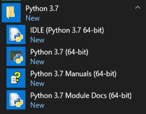
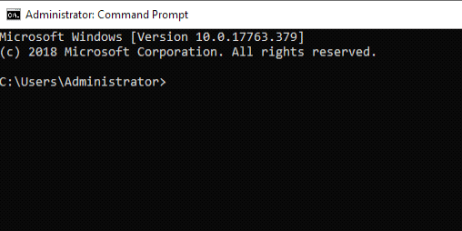
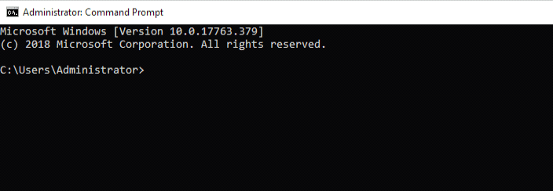
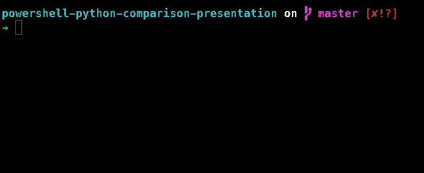
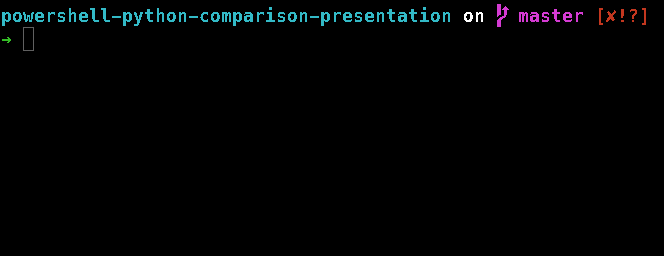
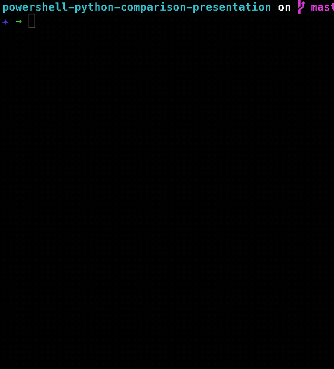

<br>
<br>
<br>
<br>
<br>
<br>
<br>
<br>
<br>
<br>
<br>
<br>
<br>
<br>
<br>
<br>
<br>
<br>

<center><h1>Python</h1></center>

<center><h2>by side</h2></center>

<center><h2>rison</h2></center>
</center>

<br>
<br>
<br>
<br>
<br>
<br>
<br>
<br>
<br>
<br>
<br>
<br>
<br>
<br>
<br>
<br>
<br>
<br>

# Python

* Tinkered with Python since 2016
* Really **started this year**
* Released several Python packages so far this year, with way more to come!

## Highlights

* **py-ews** - A cross platform Python package to access on-premises Exchange (2010 - 2019) and Office 365 Exchange Web Services
* **pyattck** - (SHH!) A cross platform Python package that wraps Mitre ATT&CK Framework, including relationshsips between data points.
* **graphish** - A Python package to Search * Delete emails from Office 365 using Microsoft's Graph API
* Others i'm working on currently:
  * soc-faker
  * MDATP
  * trawl/spotter
  * etc
<br>
<br>
<br>
<br>
<br>
<br>
<br>
<br>
<br>
<br>
<br>
<br>
<br>
<br>
<br>
<br>
<br>
<br>

# Python History

> Python is an interpreted, high-level, general-purpose programming language.

* Python - First shown publicly in 1991
* Python **2.0** - Released in 2000
  * List comprehensions, garbage collection, etc.
* Python **3.0** - Released in 2008
  * Major revision and **NOT** completely backward-compatible

> Several versions have been released for each language version (e.g. 2.* and 3.*)

## Latest

** Python **2.7** - The last release in the 2.* series and EOL in 2020
** Python **3.7** - Major release with updates/features continuing to be developed

<br>
<br>
<br>
<br>
<br>
<br>
<br>
<br>
<br>
<br>
<br>
<br>
<br>
<br>
<br>
<br>
<br>
<br>
<br>

# Python (Windows Installation)

## Python 2.* & 3.*

> Both versions have a Windows binary/installer available

## Installation Options

* Download installer from python.org
* Chocolately Package Manager
* Weird, but Windows 10 App Store
* Windows 10 Creators or Anniversary Update
  * **Windows Subsystem for Linux**

**NOTE**: that you will need to ensure that python is set in your environment path variable.

## Python Package Manager

> When python is installed, it also installs `pip` 

## pip

> PIP installs Python

> PIP installs packages

`pip` is python package manager and is used to install third-party packages/libraries from `pypi.org`

<br>
<br>
<br>
<br>
<br>
<br>
<br>
<br>
<br>
<br>
<br>
<br>
<br>
<br>
<br>

# Python (macOS & Linux Installation)

## Python 2.*

> There are a few macOS package managers but I will focus on Homebrew or brew

### macOS

    brew install python@2

### Linux

    sudo apt install python2
    sudo apt-get install python2
    sudo yum install python2
    sudo zypper install python2

## Python 3.*

### macOS

    brew install python

### Linux

    sudo apt install python3
    sudo apt-get install python
    sudo yum install python3
    sudo zypper install python3
<br>
<br>
<br>
<br>
<br>
<br>
<br>
<br>
<br>
<br>
<br>
<br>
<br>
<br>
<br>

# Python (Windows)

> Python can be accessed via the `Start Menu` 



> Or you can access it via it's own IDLE shell

## Accessing Python from cmd or PowerShell console

### Checking Versions


### Accessing Python shell


<br>
<br>
<br>
<br>
<br>
<br>
<br>
<br>
<br>
<br>
<br>
<br>
<br>
<br>
<br>

# Python (macOS)

> You can access python from any terminal/shell installed on your macOS

## Checking version installed



## Accessing the shell itself

<br>
<br>
<br>
<br>
<br>
<br>
<br>
<br>
<br>
<br>
<br>
<br>
<br>
<br>
<br>

# Python Terms

## Package
    A package is one or more python modules/scripts

## Module
    A module is a file ending in .py

## Classes
    Python has had classes since pretty much the beginning

## Methods
    Python uses Methods instead of Function but they are the same thing

## Imports
    To utilize both built-in or third-party libraries & packages you will import them into your modules
<br>
<br>
<br>
<br>
<br>
<br>
<br>
<br>
<br>
<br>
<br>
<br>
<br>
<br>
<br>

# Python Syntax

## **Everything** is an object (even text)!
- Objects (for simplicity) have both properties and methods

## Built-In libraries and packages/modules should be named without any spaces, dashes, special characters

    # Python has guidelines called PEP (Python Enhancement Proposal)
    
    PEP 8 - Style Guide for Python Code

> ### Example
    thisismyawesomepythonscript.py


## Tabs/Spaces
    Python requires that indentation is 4 spaces
<br>
<br>
<br>
<br>
<br>
<br>
<br>
<br>
<br>
<br>
<br>
<br>
<br>
<br>
<br>

# Python Help

    Lots of documentation from Python team

## Getting help from an imported package/library




## Searching

Adding `python` to any google search will result in better results

## Resources I use

+ ### Google
+ ### Python's Documentation
+ ### Stackoverflow
+ ### Blogs
<br>
<br>
<br>
<br>
<br>
<br>
<br>
<br>
<br>
<br>
<br>
<br>
<br>
<br>
<br>

# Running Scripts

## myip.py

    import requests

    response = requests.get('https://api.myip.com)

    print(response.content)

## Running myip.py

    python ./myip.py

## Returns

    {"ip":"173.26.223.222","country":"United States","cc":"US"}
<br>
<br>
<br>
<br>
<br>
<br>
<br>
<br>
<br>
<br>
<br>
<br>
<br>
<br>
<br>

# Alternate Ways of Running Python

## Running Scripts with Arguments

    > python somescript.py arg1 arg2 arg3
    
## Running Commands Directly

    > python -c "import requests; response = requests.get('https://api.myip.com); print(response.content)"

<br>
<br>
<br>
<br>
<br>
<br>
<br>
<br>
<br>
<br>
<br>
<br>
<br>
<br>
<br>
<br>
<br>
<br>
<br>
<br>
<br>
<br>
<br>
<br>

# Python Variables

> Variables are assigned to the left of an operator

    example_var = 'My Example Value'

### Conventions

> _**NOTE**_: These styles are recommendations based on **PEP** & community best practices

> Use _**descriptive**_ variable naming at all times!

    time_to_change_air_filter = datetime.now()

## **lower_case**

> Use _**lower_case**_ variable naming for all public facing code

 - Method Parameters
 - Class Parameters

## **_lower_case**

> Use a leading _ (underscore) in variable names for internal variables

## **UPPER_CASE_VARIABLES**

> Constants should use ALL_CAPS_SEPARATED_BY_UNDERSCORES

## **_ \__UPPER_CASE_VARIABLES__ _**

> Dunder (double underscore) variables are used to signify global variables but within a python module/script only

<br>
<br>
<br>
<br>
<br>
<br>
<br>
<br>
<br>
<br>
<br>
<br>
<br>
<br>
<br>

# Using Variables in Python

## Variables can dynamically change
    string_var = '1'  # actual string variable
    string_var =  1   # now an integer variable

## Variables are automatically created on first use
    num_var = 1

## Variables can contain multi-line strings
    block_var = '''
    Here's some text

    And here is some text
    ''

## Casting Variables
    num_var = '1'  # String variable
    int(num_var)   # Integer variable
<br>
<br>
<br>
<br>
<br>
<br>
<br>
<br>
<br>
<br>
<br>
<br>
<br>
<br>
<br>

# Python Strings, Quotes, & Formatting

## Single Quotes Usage
```python
some_var = 'This is a literal string'

AssertionError(some_var)  # Produces an error
print(some_var)           # prints
```
## Double Quotes Usage
> Use double quotes when part of the string has single quotes or just a general **preference**
### String Replacement
```python
my_name = 'Josh Rickard'
my_twitter = '@MSAdministrator'
my_message = 'My name is %s!' % my_name

my_message = 'My name is %s and you can find me at %s' % (my_name, my_twitter)
```
```output
My name is Josh Rickard!
My name is Josh Rickard and you can find me at @MSAdministrator
```
## Formatting Strings
```python
my_message = 'My name is {name}!'.format(my_name)
```
```output
My name is Josh Rickard!
```
<br>
<br>
<br>
<br>
<br>
<br>
<br>
<br>
<br>
<br>
<br>
<br>
<br>
<br>
<br>

# Python If statement

> An IF statement assists with logic control in scripts, methods, and classes.

```python
value = 'MSAdministrator'

if value is 'MSAdministrator':          # Notice the : ?
    print("The value is %s" % value)    # 4 spaces from the start of the if statement
```
```
The value is MSAdministrator
```
## If Else
```python
value = 'MSAdministrator'

if value is 'Josh':
    print("The value is %s" % value)
else:
    print("The value is %s" % value)
    # The pythonic way is to not do this
```
```output
The value is MSAdministrator
```
<br>
<br>
<br>
<br>
<br>
<br>
<br>
<br>
<br>
<br>
<br>
<br>
<br>
<br>
<br>

# Python If statement

## IF ELIF ELSE
```python
value = 'MSAdministrator'

if value == 'Josh':
    print("The value == %s" % value)
elif 'Admin' in value:
    print("The value contains Admin")
else:
    print("The value is %s" % value)
```
```output
The value contains Admin
```

## Other

```python
value = 'Josh'

if value not 'MSAdministrator':
    print('The value is NOT MSAdministrator')
elif 'Admin' in value:
    print('The value contains Admin')
else:
    print("The value is %s" % value)
```
```output
The value is NOT MSAdministrator
```
<br>
<br>
<br>
<br>
<br>
<br>
<br>
<br>
<br>
<br>
<br>
<br>
<br>
<br>
<br>

# Python Comparison Operators
> Comparison operators let you specify conditions for comparing values and finding values that match specified patterns.

| Operator | Description    | Example |
|------|--------------|-------------|
|in|Evaluates to true if it finds a variable in the specified sequence and false otherwise.|x in y, here in results in a 1 if x is a member of sequence y.|
|not in|Evaluates to true if it does not finds a variable in the specified sequence and false otherwise.|x not in y, here not in results in a 1 if x is not a member of sequence y.|
|is|Evaluates to true if the variables on either side of the operator point to the same object and false otherwise.|x is y, here is results in 1 if id(x) equals id(y).|
|is not|Evaluates to false if the variables on either side of the operator point to the same object and true otherwise.|x is not y, here is not results in 1 if id(x) is not equal to id(y).|
|==|If the values of two operands are equal, then the condition becomes true.|(a == b) is not true.|
|!=|If values of two operands are not equal, then condition becomes true.|(a != b) is true.|
|<>|If values of two operands are not equal, then condition becomes true.	|(a <> b) is true. This is similar to != operator.|
|>|If the value of left operand is greater than the value of right operand, then condition becomes true.|(a > b) is not true.|
|<|If the value of left operand is less than the value of right operand, then condition becomes true.|(a < b) is true.|
|>=|If the value of left operand is greater than or equal to the value of right operand, then condition becomes true.|(a >= b) is not true.|
|<=|If the value of left operand is less than or equal to the value of right operand, then condition becomes true.|(a <= b) is true|
<br>
<br>
<br>
<br>
<br>
<br>
<br>
<br>
<br>
<br>
<br>
<br>
<br>
<br>
<br>

# Python Lists
```python
my_list = [] # Empty list

my_list = ['Josh','Rickard','@MSAdministrator']
my_list
```
```output
Josh
Rickard
@MSAdministrator
```
> ### Indexes of Lists start at **0**

```python
"Find %s on Twitter %s" % (my_list[0], my_list[2])
```
```output
Find Josh on Twitter @MSAdministrator
```
## Accessing Array Elements
```powershell
array = [22,5,10,8,12,9,80]
array[0] # 22
array[-1] # 80
```
## Appending
```python
my_list = []
for item in ('Josh', 'Rickard', 'MSAdministrator'):
    my_list.append(item)
```
<br>
<br>
<br>
<br>
<br>
<br>
<br>
<br>
<br>
<br>
<br>
<br>
<br>
<br>
<br>

# Python Dictionary's
>  Dictionary's are a compact data structure that stores one or more key/value pairs
## Associative Array's

```
{ <name> = <value>, <name> = {<name> = <value>}, ...}
```

```python
my_dict = {}     # Empty dictionary

# They don't have to be empty
my_dict = {
    'Number':1,
    'Shape':'Square',
    'Color':'Blue'
}

print(my_dict)
```
```output
{'Color': 'Blue', 'Shape': 'Square', 'Number': 1}
```
## Accessing Dictionary Values
```python
my_dict['Color']
```
```output
Blue
```
<br>
<br>
<br>
<br>
<br>
<br>
<br>
<br>
<br>
<br>
<br>
<br>
<br>
<br>
<br>

# Python Dictionary's Continued

## Get a count of key/value pairs
```python
len(my_dict)      # 3
```
## Access a value by referencing the key name
```python
my_dict['Shape']    # Square
```
## Adding to a dictionary
```python
my_dict.update({
    'Time': 'Now'
})

a = 'Time'
my_dict.update(a='Now')
```
<br>
<br>
<br>
<br>
<br>
<br>
<br>
<br>
<br>
<br>
<br>
<br>
<br>
<br>
<br>

# Python For(each) Loops
```
for <item> in <collection>:
    <statement list>
```
## Example

```python
import psutil

for proc in psutil.process_iter(attrs=['pid', 'name', 'username', 'memory_percent', 'status']):
    print(proc.info)
    input('')
```
```output
{'pid': 0, 'status': 'running', 'name': 'kernel_task', 'username': 'root', 'memory_percent': None}

{'pid': 1, 'status': 'running', 'name': 'launchd', 'username': 'root', 'memory_percent': None}

{'pid': 40, 'status': 'running', 'name': 'syslogd', 'username': 'root', 'memory_percent': None}

{'pid': 41, 'status': 'running', 'name': 'UserEventAgent', 'username': 'root', 'memory_percent': None}

{'pid': 44, 'status': 'running', 'name': 'uninstalld', 'username': 'root', 'memory_percent': None}

{'pid': 45, 'status': 'running', 'name': 'kextd', 'username': 'root', 'memory_percent': None}
```
<br>
<br>
<br>
<br>
<br>
<br>
<br>
<br>
<br>
<br>
<br>
<br>
<br>
<br>
<br>

# Python For Loop (alternative)

> ## There really is not a for (indexed) loop in Python

## Example

```python
presidents = ["Washington", "Adams", "Jefferson", "Madison", "Monroe", "Adams", "Jackson"]
for i in range(len(presidents)):
    print("President {}: {}".format(i + 1, presidents[i]))

colors = ["red", "green", "blue", "purple"]
i = 0
while i < len(colors):
    print(colors[i])
    i += 1
```
<br>
<br>
<br>
<br>
<br>
<br>
<br>
<br>
<br>
<br>
<br>
<br>
<br>
<br>
<br>
<br>
<br>
<br>
<br>
<br>
<br>
<br>

# Python Script
> All scripts run from top to bottom

## Mitre ATT&CK Example

```python
import requests

return_list = []

url = 'https://raw.githubusercontent.com/mitre/cti/master/enterprise-attack/enterprise-attack.json'

resp = requests.get(url)
attck = resp.json()

for item in attck['objects']:
    if 'attack-pattern' in item['type']:
        phases = []
        requirements = []
        platforms = []
        for phase in item['kill_chain_phases']:
            phases.append(phase['phase_name'])
        if 'x_mitre_system_requirements' in item:
            for requirement in item['x_mitre_system_requirements']:
                requirements.append(requirement)
        for platform in item['x_mitre_platforms']:
            platforms.append(platform)

        return_list.append({
            'Technique': item['name'],
            'Tactic': phases,
            'Requirements': requirements,
            'Detection': None if 'x_mitre_detection' not in item else item['x_mitre_detection'],
            'Platforms': platforms
        })

print(return_list)
```
```output
[{'Detection': u'While users may customize their <code>~/.bashrc</code> and <code>~/.bash_profile</code> files , there are only certain types of commands that typically appear in these files. Monitor for abnormal commands such as execution of unknown programs, opening network sockets, or reaching out across the network when user profiles are loaded during the login process.',
  'Platforms': [u'Linux', u'macOS'],
  'Requirements': [],
  'Tactic': [u'persistence'],
  'Technique': u'.bash_profile and .bashrc'},
 {'Detection': u'If an adversary is using a standard command-line shell, analysts can detect token manipulation by auditing command-line activity. Specifically, analysts should look for use of the <code>runas</code> command. Detailed command-line logging is not enabled by default in Windows. (Citation: Microsoft Command-line Logging)\n\nIf an adversary is using a payload that calls the Windows token APIs directly, analysts can detect token manipulation only through careful analysis of user network activity, examination of running processes, and correlation with other endpoint and network behavior. \n\nThere are many Windows API calls a payload can take advantage of to manipulate access tokens (e.g., <code>LogonUser</code> (Citation: Microsoft LogonUser), <code>DuplicateTokenEx</code> (Citation: Microsoft DuplicateTokenEx), and <code>ImpersonateLoggedOnUser</code> (Citation: Microsoft ImpersonateLoggedOnUser)). Please see the referenced Windows API pages for more information.\n\nQuery systems for process and thread token information and look for inconsistencies such as user owns processes impersonating the local SYSTEM account. (Citation: BlackHat Atkinson Winchester Token Manipulation)',
  'Platforms': [u'Windows'],
  'Requirements': [],
  'Tactic': [u'defense-evasion', u'privilege-escalation'],
  'Technique': u'Access Token Manipulation'},
 {'Detection': u'Changes to accessibility utility binaries or binary paths that do not correlate with known software, patch cycles, etc., are suspicious. Command line invocation of tools capable of modifying the Registry for associated keys are also suspicious. Utility arguments and the binaries themselves should be monitored for changes. Monitor Registry keys within <code>HKEY_LOCAL_MACHINE\\SOFTWARE\\Microsoft\\Windows NT\\CurrentVersion\\Image File Execution Options</code>.',
  'Platforms': [u'Windows'],
  'Requirements': [],
  'Tactic': [u'persistence', u'privilege-escalation'],
  'Technique': u'Accessibility Features'},
```
<br>
<br>
<br>
<br>
<br>
<br>
<br>
<br>
<br>
<br>
<br>
<br>
<br>
<br>
<br>

# Python Methods

```python
import requests

__URL__ = 'https://raw.githubusercontent.com/mitre/cti/master/enterprise-attack/enterprise-attack.json'

def get_techniques(tactic):
    return_list = []
    resp = requests.get(__URL__)
    attck = resp.json()

    for item in attck['objects']:
        if 'attack-pattern' in item['type']:
            phases = []
            for phase in item['kill_chain_phases']:
                if tactic in phase['phase_name']:
                    phases.append(phase['phase_name'])
                
                    requirements = []
                    platforms = []
                    if 'x_mitre_system_requirements' in item:
                        for requirement in item['x_mitre_system_requirements']:
                            requirements.append(requirement)
                    for platform in item['x_mitre_platforms']:
                        platforms.append(platform)

                    return_list.append({
                        'Technique': item['name'],
                        'Tactic': phases,
                        'Requirements': requirements,
                        'Detection': None if 'x_mitre_detection' not in item else item['x_mitre_detection'],
                        'Platforms': platforms
                    })

    return return_list

print(get_techniques('privilege-escalation'))
```
## Calling our Function

```python
get_techniques('privilege-escalation')
```
<br>
<br>
<br>
<br>
<br>
<br>
<br>
<br>
<br>
<br>
<br>
<br>
<br>
<br>
<br>
<br>
<br>
<br>
<br>
<br>
<br>
<br>
<br>
<br>
<br>
<br>
<br>

# Python Advanced Method

```python
def function_or_method_name(var_1, var_2: str, var_3=None):
    """[summary]
    
    Args:
        var_1 ([type]): [description]
        var_2 (str): [description]
        var_3 ([type], optional): [description]. Defaults to None.
    
    Returns:
        [type]: [description]
    """

```
<br>
<br>
<br>
<br>
<br>
<br>
<br>
<br>
<br>
<br>
<br>
<br>
<br>
<br>
<br>
<br>
<br>
<br>
<br>
<br>
<br>
<br>
<br>
<br>
<br>
<br>
<br>

# Python Advanced Methods

```python
import requests

__ATTCK_PHASES__ = [
    "privilege-escalation",
    "defense-evasion",
    "persistence",
    "discovery",
    "credential-access",
    "execution",
    "lateral-movement",
    "collection",
    "exfiltration",
    "command-and-control",
    "impact",
    "initial-access"
    ]

__URL__ = 'https://raw.githubusercontent.com/mitre/cti/master/enterprise-attack/enterprise-attack.json'

def get_attck_object(url=__URL__):
    response = requests.get(url)
    return response.json()['objects']

def _get_technique_properties(obj, tactic: str):
    phases = []
    for phase in obj['kill_chain_phases']:
        if tactic in __ATTCK_PHASES__ and tactic in phase['phase_name']:
            phases.append(phase['phase_name'])
            requirements = []
            platforms = []
            if 'x_mitre_system_requirements' in obj:
                for requirement in obj['x_mitre_system_requirements']:
                    requirements.append(requirement)
            for platform in obj['x_mitre_platforms']:
                platforms.append(platform)
            return {
                'Technique': obj['name'],
                'Tactic': phases,
                'Requirements': requirements,
                'Detection': None if 'x_mitre_detection' not in obj else obj['x_mitre_detection'],
                'Platforms': platforms
            }

def get_techniques(tactic):
    return_list = []
    for item in get_attck_object():
        if 'attack-pattern' in item['type']:
            return_list.append(_get_technique_properties(item, tactic))
    return return_list

print(get_techniques('privilege-escalation'))
```
## Calling our Function

```python
get_techniques('privilege-escalation')
```
<br>
<br>
<br>
<br>
<br>
<br>
<br>
<br>
<br>
<br>
<br>
<br>
<br>
<br>
<br>

# Python Classes
> This is where Python **shines**
```python
import json, requests
from .technique import AttckTechnique
from .actor import AttckActor
from .malware import AttckMalware
from .tools import AttckTools
from .mitigation import AttckMitigation
from .tactic import AttckTactic

__MITRE_ATTCK_JSON_URL__ = 'https://raw.githubusercontent.com/mitre/cti/master/enterprise-attack/enterprise-attack.json'


class Attck(object):
    """This class creates an interface to all other classes and generates objects from the Mitre ATT&CK Framework json file.
    
    Returns:
        [Attck]: Returns a Attck object that contains all data from the Mitre ATT&CK Framework
    """

    def __init__(self):
        self.attck = __MITRE_ATTCK_JSON_URL__

    @property
    def attck(self):
        return self._attck
    
    @attck.setter
    def attck(self, value):
        """Requests the Mitre ATT&CK json file
        
        Arguments:
            url (str) -- Requests the JSON via a provided URL

        Returns:
            (dict) -- Returns the requested json file
        """
        self._attck = requests.get(value).json()

    @property
    def tactics(self):
        """Creates AttckTactic objects
        
        Returns:
            (AttckTactic) -- (Returns a list of AttckTactic objects)
        """
        tactic_list = []
        for tactic in self.attck['objects']:
            if tactic['type'] == 'x-mitre-tactic':
                tactic_list.append(AttckTactic(attck_obj=self.attck, **tactic))
        return tactic_list

    @property
    def mitigations(self):
        """Creates AttckMitigation objects
        
        Returns:
            (AttckMitigation) -- (Returns a list of AttckMitigation objects)
        """
        mitigation_list = []
        for mitigation in self.attck['objects']:
            if mitigation['type'] == 'course-of-action':
                mitigation_list.append(AttckMitigation(attck_obj=self.attck, **mitigation))
        return mitigation_list
                
    @property
    def actors(self):
        """Creates AttckActor objects
        
        Returns:
            (AttckActor) -- (Returns a list of AttckActor objects)
        """
        group_list = []
        for group in self.attck['objects']:
            if group['type'] == 'intrusion-set':
                group_list.append(AttckActor(attck_obj=self.attck, **group))
        return group_list

    @property
    def tools(self):
        """Creates AttckTools objects
        
        Returns:
            (AttckTools) -- Returns a list of AttckTools objects
        """
        tools_list = []
        for tools in self.attck['objects']:
            if (tools['type'] == 'tool'):
                tools_list.append(AttckTools(attck_obj=self.attck, **tools))
        return tools_list

    @property
    def malwares(self):
        """Creates AttckMalware objects
        
        Returns:
            (AttckMalware) -- Returns a list of AttckMalware objects
        """
        malware_list = []
        for malware in self.attck['objects']:
            if (malware['type'] == 'malware'):

                malware_list.append(AttckMalware(attck_obj=self.attck, **malware))
        return malware_list

    @property
    def techniques(self):
        """Creates AttckTechnique objects
        
        Returns:
            (AttckTechnique) -- Returns a list of AttckTechnique objects
        """
        technique_list = []
        for technique in self.attck["objects"]:
            if (technique['type'] == 'attack-pattern'):
                technique_list.append(AttckTechnique(attck_obj=self.attck, **technique))
        return technique_list
```

<br>
<br>
<br>
<br>
<br>
<br>
<br>
<br>
<br>
<br>
<br>
<br>
<br>
<br>
<br>


# Contact Info

## Blog: https://letsautomate.it

## GitHub: https://github.com/MSAdministrator

> THIS PRESENTATION WILL BE UP ON MY GITHUB TONIGHT OR TOMORROW

## Twitter: @MSAdministrator

## Work Email: josh.rickard@swimlane.com

<br>
<br>
<br>
<br>
<br>
<br>
<br>
<br>
<br>
<br>
<br>
<br>
<br>
<br>
<br>